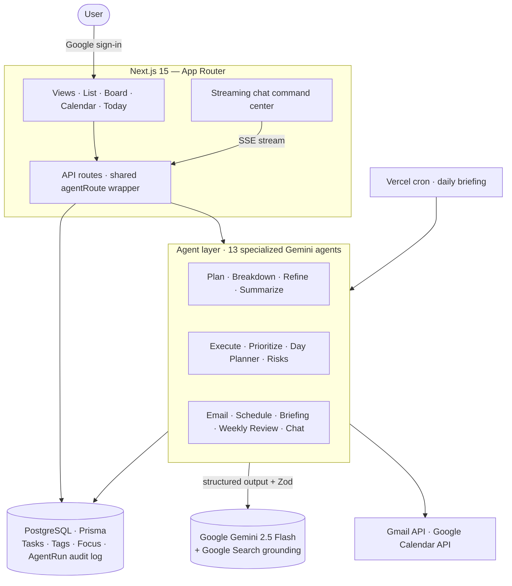

<div align="center">

# TaskAgent

### An AI task manager where agents don't just organize your work — they _do_ it.

[](https://taskagent-amber.vercel.app)
&nbsp;
[](https://nextjs.org)
[](https://www.typescriptlang.org)
[](https://www.prisma.io)
[](https://neon.tech)
[](https://ai.google.dev)
[](https://tailwindcss.com)

**[Live demo](https://taskagent-amber.vercel.app)** · [What it does](#what-it-does) · [Agents](#meet-the-agents) · [Architecture](#architecture) · [How it works](#how-it-works) · [Getting started](#getting-started)

</div>

---

TaskAgent is a full-stack AI productivity app built around one idea: a task list should be able to **carry tasks out**, not just hold them. You describe a goal in plain language and a roster of specialized agents plan it, break it into steps, **search the live web to actually execute it**, prioritize your day, draft and send email, book calendar time, flag risks, and brief you each morning — each step gated by your approval where it touches the outside world.

<!-- Drop a product screenshot or GIF here for the strongest first impression:
      -->

## What it does

- **Agents that act, not just suggest.** The Execute agent uses Gemini's live Google Search grounding to do real research and returns cited results as rich preview cards — not generic advice.
- **A natural-language command center.** A streaming chat sidebar answers questions about your work _and_ acts on it: "mark the gym task done", "push my overdue tasks to tomorrow", "plan a trip to Lisbon" — replies stream token-by-token while the same response safely applies the action.
- **Real Google integration, safely.** Agents draft email from your own Gmail and propose calendar slots around your real free/busy — but **nothing sends or books without an explicit click**. There is no auto-send path in the code.
- **Runs at $0 out of the box.** With no API key set, every agent returns realistic placeholder output (demo mode), so the entire product is explorable for free; real agents switch on the moment a key is present.

## Meet the agents

Sign in with Google, then open any task to reach its agents. They **share context** — answers you give one agent (dates, budget, who's travelling) are saved to the plan and reused by the rest, so they stop re-asking what's already known.

| Agent                          | What it does                                                                                                                                                                         |
| ------------------------------ | ------------------------------------------------------------------------------------------------------------------------------------------------------------------------------------ |
| **Plan**                       | Turns a plain-language goal ("plan a trip to Lisbon") into a task with ordered subtasks.                                                                                             |
| **Breakdown**                  | Splits a task into 3–7 ordered, time-estimated steps.                                                                                                                                |
| **Refine**                     | Sharpens a vague task into a clear title, description, and acceptance criteria for you to review.                                                                                    |
| **Execute** _(Do it / Do all)_ | **Actually performs the task** via Gemini + live Google Search, returning cited results as rich cards — for a single step or every subtask in sequence, sharing each result forward. |
| **Prioritizer**                | Reweighs every open task by urgency, due date, and effort, reorders your day, and explains why.                                                                                      |
| **Daily Briefing**             | A short morning brief: what's due, what's overdue, what to focus on.                                                                                                                 |
| **Summary**                    | Rolls a whole plan — subtasks and their results — up into a status briefing.                                                                                                         |
| **Risks & blockers**           | Reviews a task and surfaces its likely risks (each with a mitigation) plus any prerequisites to resolve first. Advisory only.                                                        |
| **Email**                      | Drafts an email about a task for you to review, then **sends it from your own Gmail** only after you click Send.                                                                     |
| **Schedule**                   | Reads your Google Calendar busy times, proposes slots, and **books the event** on approval.                                                                                          |
| **Day Planner**                | "Plan my day" proposes time blocks for your top tasks around what's already scheduled — untick what you don't want, apply the rest. No calendar required.                            |
| **Weekly Review**              | A retro of your last 7 days: wins, what slipped, and a suggested focus for next week.                                                                                                |
| **Chat**                       | A streaming assistant and command center over all of the above.                                                                                                                      |

## Architecture



Agents live in `src/lib/agents/*` as plain functions; thin API routes wrap them through a single shared helper (`src/lib/agent-route.ts`) that handles auth, per-user rate limiting, validation, the demo flag, and error mapping — so each route is just its handler.

## How it works

- **Structured + validated.** Every Gemini call uses a `responseSchema` and is re-validated with **Zod**, so agent output is always well-formed before it touches the database.
- **Execution by grounding.** The Execute agent runs Gemini with **Google Search grounding**, then `link-preview.ts` fetches each source's OpenGraph data (behind an SSRF guard) so results render as rich, cited cards.
- **Streaming chat, the clever bit.** The chat schema puts the `reply` field first, so the route decodes that prefix out of the **partial** structured-output JSON and forwards characters over Server-Sent Events as they generate — while the _same_ response still carries ownership-checked **actions** (complete / reprioritize / reschedule) and create-task intents dispatched to the Planner.
- **Real integrations.** Email and Schedule call the Gmail and Google Calendar APIs (`google.ts`) using the user's stored OAuth token with automatic refresh. Drafting/proposing and sending/booking are **separate endpoints** — the draft route never sends.
- **Automatic mornings.** A Vercel cron (`/api/cron/briefing`, authenticated with `CRON_SECRET`) generates a briefing for every active user and emails opted-in users via their own Gmail.
- **Auditable & guarded.** Every agent run is recorded in an `AgentRun` table (input, output, status, tokens) and surfaced on the dashboard, a filterable **Agent activity** page, and each task's own activity log; every agent route is authenticated, user-scoped, and per-user rate-limited, with graceful handling of provider quota (429).
- **Incremental OAuth.** Base sign-in requests only `openid email profile`; the sensitive Gmail/Calendar scopes are requested on demand via an in-app "Connect Google" step.

## Tech stack

| Layer        | Technology                                                            |
| ------------ | --------------------------------------------------------------------- |
| Framework    | Next.js 15 (App Router, React Server Components)                      |
| Language     | TypeScript                                                            |
| AI           | Google Gemini 2.5 Flash — structured output + Google Search grounding |
| Database     | PostgreSQL (Neon) via Prisma ORM                                      |
| Auth         | NextAuth v5 — Google OAuth, JWT sessions                              |
| Integrations | Gmail API · Google Calendar API                                       |
| UI           | Tailwind CSS v4 · Radix primitives · Motion · Sonner                  |
| Validation   | Zod                                                                   |
| Testing      | Vitest                                                                |
| Hosting      | Vercel (cron) + Neon Postgres                                         |

## Feature tour

Beyond the agents, TaskAgent is a complete task workspace:

- **Three views** — a tile **list**, a drag-and-drop **Kanban board**, and a **calendar** (week + month) that plots tasks by scheduled time or due date, with drag-to-reschedule.
- **Today / Focus page** — a time-of-day greeting with everything that needs attention, one-click complete, snooze, "Plan my day", and your morning briefing.
- **Natural-language quick capture** — typing `Email Dan tomorrow !high` sets the due date and priority automatically; plus templates, CSV/paste import, and a **⌘K command palette**.
- **Organize** — colored tags, priorities, pin-to-top, recurring tasks (daily/weekly/monthly/yearly), and manual drag-to-reorder.
- **Notes & activity** — keep free-form notes on any task, and see a per-task activity log of every agent run plus the time you've focused on it.
- **Archive** — tuck finished or stale tasks out of your lists and restore them anytime from the Archive page.
- **Dashboard** — task stats, completion streak, open-work time estimate, focus-time analytics, a 14-day activity chart, by-agent breakdown, and a recent-run drill-down.

<details>
<summary><b>See the full feature list</b></summary>

- **Quick capture:** natural-language quick-add across the list bar, board/calendar add, and steps; reusable templates (save a task + steps, recreate in one click); CSV / paste import; ⌘K palette (jump to a view, search, new task, new from template, import).
- **Inline editing everywhere:** click a tile's priority to cycle it or its due chip to pick a date; the detail edits title, description (Markdown), priority, due, and tags in place; steps can be renamed, reordered (drag), run, completed, and deleted.
- **Find & focus:** search with match highlighting that also looks inside agent results and summaries; filters (priority / tag / due window) with one-click "N overdue · N due today" chips; hide-done toggle; saved views; sort by smart / due / priority / title / manual.
- **Bulk actions:** multi-select to set status, priority, or due date, add a tag, or delete — with select all / none and a **5-second Undo** on deletes and clear-completed.
- **Archive & notes:** archive a task to hide it from your lists (restore it from the Archive page), and keep free-form working notes on any task.
- **Smart due dates:** relative labels ("Today", "Tomorrow", "2d overdue", "in 3d") with overdue/soon highlighting.
- **Reminders & preferences:** opt-in browser notifications for due-soon tasks; a settings page (default view/sort/priority, focus length, confetti, reminders, reset local data); persisted chat history.
- **Keyboard shortcuts:** `⌘K` palette · `n` new task · `/` search · `b` toggle list/board · `g` then `t`/`c`/`d`/`s` to navigate · `?` help; calendar `←`/`→`, `t`, `w`/`m`.
- **Focus timer:** a per-task Pomodoro (length configurable in Settings) whose completed sessions are saved server-side and roll up into focus-time analytics.
- **Installable PWA:** add TaskAgent to your home screen / desktop (web manifest, branded icon, standalone display).
- **Touches:** copy a task as Markdown, export the whole workspace as Markdown / CSV / JSON, copy a shareable task link, confetti when you finish your last task.

</details>

## Getting started

```bash
git clone https://github.com/Barel-dev/Taskagent && cd Taskagent
npm install
cp .env.example .env.local   # fill in the values below
npx prisma migrate dev
npm run dev
```

| Variable                                | Notes                                                                                                                                                                                            |
| --------------------------------------- | ------------------------------------------------------------------------------------------------------------------------------------------------------------------------------------------------ |
| `DATABASE_URL`                          | Postgres (Neon) connection string                                                                                                                                                                |
| `TEST_DATABASE_URL`                     | Separate Neon branch used by the test suite                                                                                                                                                      |
| `AUTH_SECRET`                           | `openssl rand -base64 32`                                                                                                                                                                        |
| `AUTH_GOOGLE_ID` / `AUTH_GOOGLE_SECRET` | Google OAuth credentials. For Email/Schedule, also enable the Gmail + Calendar APIs and add the `gmail.send`, `calendar.events`, and `calendar.freebusy` scopes, then **Connect Google** in-app. |
| `GEMINI_API_KEY`                        | Free key from [aistudio.google.com/apikey](https://aistudio.google.com/apikey) — _optional; without it, demo mode_                                                                               |
| `CRON_SECRET`                           | Random secret for the daily-briefing cron — _optional; without it the cron route stays off_                                                                                                      |

> **Tip:** skip `GEMINI_API_KEY` to run the whole app in demo mode at zero cost.

## Testing

```bash
npm test    # Vitest — Zod validators, the data layer, and every agent (Gemini mocked, $0),
            # plus pure-function tests for filtering, sorting, due labels,
            # and the natural-language quick-add parser.
```

## Deployment (Vercel)

1. Import the repo on Vercel.
2. Set the build command to `prisma migrate deploy && next build` (migrations auto-apply on deploy).
3. Add the environment variables above (`GEMINI_API_KEY` included for real agents).
4. Register `https://<your-domain>/api/auth/callback/google` as a Google OAuth redirect URI.

## Engineering highlights

- Built a **full-stack AI task manager** (Next.js 15, TypeScript, Prisma/Postgres, NextAuth) where **13 specialized agents** plan, execute, prioritize, schedule, email, brief, assess, and review work.
- Implemented an **agent that performs tasks autonomously** via Gemini with **live web-search grounding**, returning cited rich results — with structured-output + Zod validation, shared cross-agent context, per-user rate limiting, and an audit log.
- Engineered a **streaming natural-language command center**: chat replies stream over SSE by incrementally decoding structured-output JSON, while the same response carries ownership-validated actions that complete, reprioritize, and reschedule tasks.
- Integrated the **Gmail and Google Calendar APIs** so agents draft/send email and propose/book events from the user's account, with OAuth token auto-refresh, incremental scope consent, and a mandatory human-approval step (no auto-send/-book path in code); a **Vercel cron** emails a daily briefing to opted-in users.
- Designed a premium, responsive UI (tile grid + detail modal, three views, command palette) and shipped it to Vercel, backed by a Vitest suite covering validators, the data layer, and all agents.
